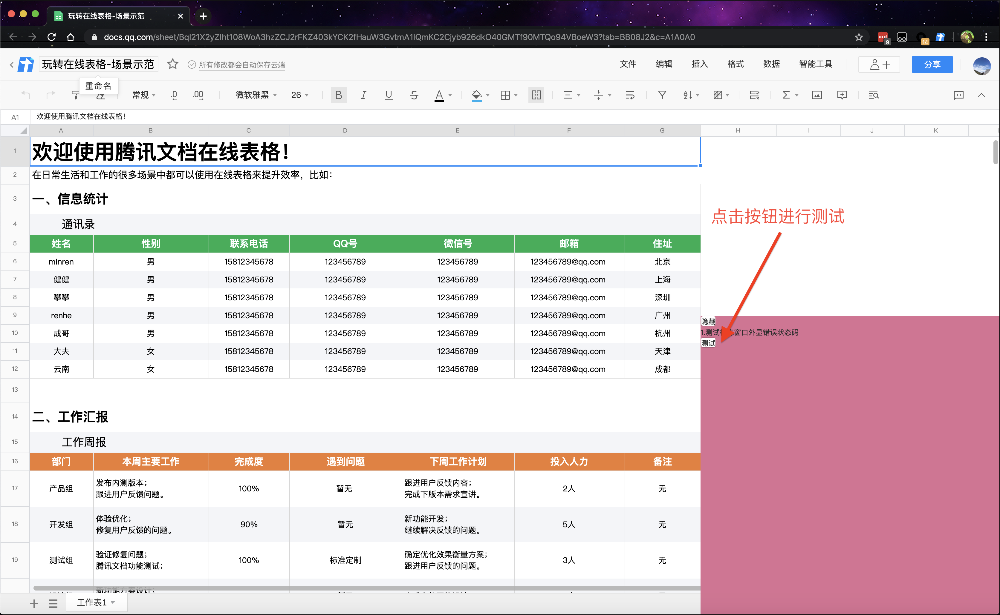

# 开发

```sh
# 下载项目
git clone https://git.code.oa.com/tencent-doc/tencent-docs-devtools
# 进入项目目录
cd tencent-docs-devtools
# 安装依赖
npm install
# 调试
npm run watch
# 编译打包
npm run build
```

# 安装

将下载好的 tencent-docs-extension.zip 压缩文件解压，得到一个文件夹，里面内容如下。

- tencent-docs-extension文件夹目录
    - dist
    - manifest.json
    - src
    - README.md


然后打开 Chrome 浏览器，点击右上角三个点，点击`更多工具`，选择`扩展程序`进入插件管理界面。


打开右上角的`开发者模式`，会在左边出现点击`加载已解压的扩展程序`，选取解压后的文件夹，并点击`选择`。


如果出现面板出现`Tencent Docs Dev Tools`则证明安装成功。


然后打开你的需要调试的[文档](https://docs.qq.com/desktop)进行测试。

现在的界面会比较粗糙，比如当你打开文档后会在右下角出现一个红色背景的弹窗，里面会有错误弹窗的测试按钮，点击可运行测试，后续会变更到调试控制台里面。


